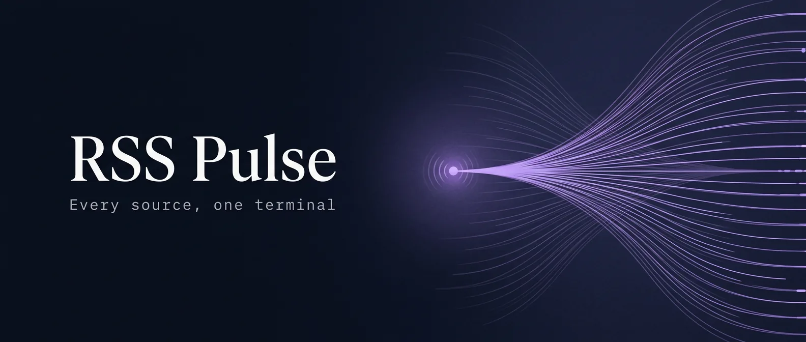

<p align="center"></p>

<div align="center">


<br/><br/>

**Live feed intelligence. Every source, one terminal.**

<br/>


</div>

<br/>


---

## What is RSS Pulse?

RSS Pulse is a self-hosted RSS aggregator dashboard with a dark editorial UI. It proxies and parses RSS 2.0, Atom, and RDF feeds server-side — bypassing CORS restrictions — and presents them in a clean, responsive interface with real-time search, per-feed filtering, skeleton loading, and auto-refresh.

---

## Features

- **Universal feed support** — RSS 2.0, Atom, and RSS 1.0 (RDF)
- **Dark editorial UI** — sidebar layout, staggered card animations, skeleton loaders, toast notifications
- **Real-time search** — instant client-side filtering across all loaded feeds
- **Per-feed filter tabs** — jump to any single source with one click
- **Auto-refresh** — feeds silently reload every 5 minutes
- **CORS proxy** — the Express server fetches and parses XML server-side so any feed works
- **Time-ago timestamps** — human-readable relative dates (e.g. "3h ago")
- **Responsive** — sidebar collapses on mobile

---

## Quick Start

```bash
# Clone
git clone https://github.com/ronithrashmikara/RSS-Feed.git
cd RSS-Feed

# Install
npm install

# Run
npm start        # production  →  http://localhost:12000
npm run dev      # dev (nodemon, auto-restart on changes)
```

Open **http://localhost:12000** — Hacker News loads automatically on first visit.

---

## Project Structure

```
RSS-Feed/
├── server.js       # Express server + RSS proxy + XML parser (RSS 2.0, Atom, RDF)
├── index.html      # Single-page dashboard (no build step required)
└── package.json
```

---

## API

| Method | Endpoint | Description |
|--------|----------|-------------|
| `GET` | `/` | Serve the dashboard |
| `GET` | `/api/rss?url=<feed-url>` | Fetch and parse an RSS/Atom/RDF feed |
| `GET` | `/api/health` | Health check — returns `{ status, timestamp }` |

**Example:**
```
GET /api/rss?url=https://hnrss.org/frontpage
```

---

## Tech Stack

| Layer | Tool |
|-------|------|
| Runtime | Node.js |
| Server | Express 4 |
| HTTP client | Axios |
| XML parser | xml2js |
| Frontend | Vanilla HTML / CSS / JS — zero build step |
| Fonts | Syne · Syne Mono · DM Sans (Google Fonts) |

---

## Environment

```bash
PORT=12000   # default — override with environment variable
```

---

## License

MIT © [ronithrashmikara](https://github.com/ronithrashmikara)
